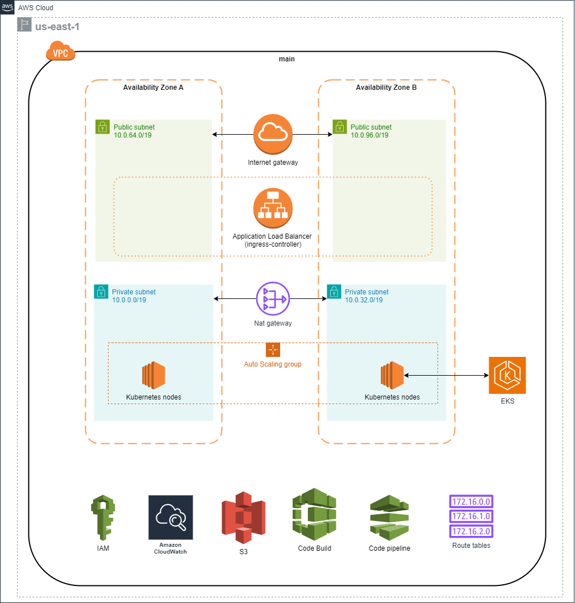

# simetrik-tech-test

## Diagram



## Deployment guide

### Pre-requisites:

Have locally installed:

* Helm (version 3.14.3)
* Terraform (version 1.7.5)
* Kubectl (version 1.29.3)
* eksctl (version 0.175.0)

Manually create S3 backend

* Login to your AWS Account
* Go to the S3 service
* Create new bucket
  * Name: "mcorall-terraform-tfstate"
  * Enable bucket versioning
  * Enable encryption

Manually create "service account"/IAM User and AWS Access Key and Secret Key (This is going to be used to create the CI/CD Infrastructure locally)

* Login to your AWS Account
* Go to the IAM service
* Create a new user named "terraform-service-account"
* Assign the following permissions to the user
  * AmazonEC2FullAccess
  * AmazonS3FullAccess
  * AWSCloudFormationFullAccess
  * AWSCodeBuildAdminAccess
  * AWSCodePipeline_FullAccess
  * AWSCodeStarFullAccess
  * IAMFullAccess
* Create the IAM User
* Create the AWS Secret Key and AWS Access Key

Manually create the following IAM roles:
* <span style="color:blue">**codebuild-role**</span>  
With permissions:
  * AmazonEC2FullAccess
  * AmazonS3FullAccess
  * CloudWatchFullAccessV2
  * CloudWatchLogsFullAccess
  * IAMFullAccess
  * AWSCloudFormationFullAccess
  * EKS-Full-Access (Create this policy) 

<span style="color:red">**NOTE:**</span>  
This role can be assume by: <span style="color:blue">terraform-service-account</span> 

* <span style="color:blue">**codepipeline-role**</span>  
With permissions:
  * AmazonS3FullAccess
  * AWSCodeBuildAdminAccess
  * AWSCodeStarFullAccess
  * CloudWatchFullAccessV2

Manually create the github connection (This is going to be used by the AWS CodePipeline to get the changes)

* Login to your AWS Account
* Go to the service Developer Tools
* Click on Settings
* Click on Connections
* Create a new connection
  * Set a name
  * Create a github application 
* Link them

### Main Steps to deploy
---

The guide is divided in 4 main steps.

* The first step is to deploy the CI/CD Infrastructure
* The second step is to use the CI/CD pipelines to deploy 
* Deploy all the necessary resources (aws-lb-ingress-controller)
* Deploy the applications
---
#### First step

1. Go to the folder <span style="color:blue">**ci-cd-infra/**</span>
2. Configure the AWS credentials for "terraform-service-account"
```bash
# set the access key and secret key
aws configure
```
3. Execute the following commands:
```bash
terraform init
terraform validate
terraform apply
```
---
#### Second step

<span style="color:red">**NOTE:**</span>  
After deploying the first step the AWS CodePipeline should execute the <span style="color:green">**terraform apply**</span> over the folder <span style="color:blue">**infra/**</span> so nothing should be perform here.

But just in case you want to execute the terraform locally you need to follow the steps:

1. Go to the folder <span style="color:blue">**infra/**</span>
2. Execute the following commands:
```bash
terraform init
terraform validate
terraform apply
```
---
#### Third step

1. Get the kubeconfig so you can execute kubectl commands
```bash
# First assume the role that created the cluster
aws sts assume-role --role-arn "arn:aws:iam::533267065014:role/codebuild-role" --role-session-name AWSCLI-Session

# Second the credentials and token that the previous command gave you
aws configure 
aws configure set aws_session_token "<<your session token>>"

# Get the kubeconfig
aws eks --region us-east-1 update-kubeconfig --name eks-cluster
```

2. Create the iamserviceaccount executing this command locally
```bash
eksctl create iamserviceaccount \
  --cluster=eks-cluster \
  --namespace=kube-system \
  --name=aws-load-balancer-controller \
  --role-name AmazonEKSLoadBalancerControllerRole \
  --attach-policy-arn=arn:aws:iam::533267065014:policy/AWSLoadBalancerControllerIAMPolicy \
  --approve
```

3. Install the aws-lb-ingress-controller by executing the following commands locally
```bash
helm repo add eks https://aws.github.io/eks-charts

helm repo update eks

helm install aws-load-balancer-controller eks/aws-load-balancer-controller \
  -n kube-system \
  --set clusterName=eks-cluster \
  --set serviceAccount.create=false \
  --set serviceAccount.name=aws-load-balancer-controller 
```
---
#### Fourth step

1. Go to the folder **app/**
2. Execute the following command
```bash
kubectl apply -f kubernetes.yaml
```
---
#### Finally test the application
1. Get the dns by executing the following command
```bash
kubectl get ingress -n grpc
```

2. Go to the browser and put the dns

---

### Improvements

* Allow access to more users to the cluster.
* Reduce the amount of permissions for users and roles following "The principle of least privilege" (PoLP)
* Automate this steps 
  * The creation of the IAM Roles.
  * The creation of IAM policies.
* Create a "bastion host" to managed the EKS cluster
* Define and set a branching strategy (This includes create more repos as well)