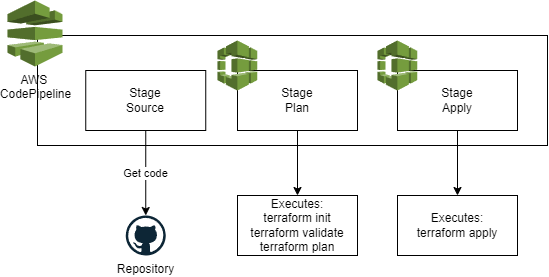

# CI/CD (AWS CodePipeline + AWS CodeBuild)

This folder contains all the needed resources to create a continous integration and continues deployment pipeline for the infrastructure.

In the folder **buildspec/** you can see the yaml files with the steps to execute terraform init, validate, plan and apply.

## Diagram
